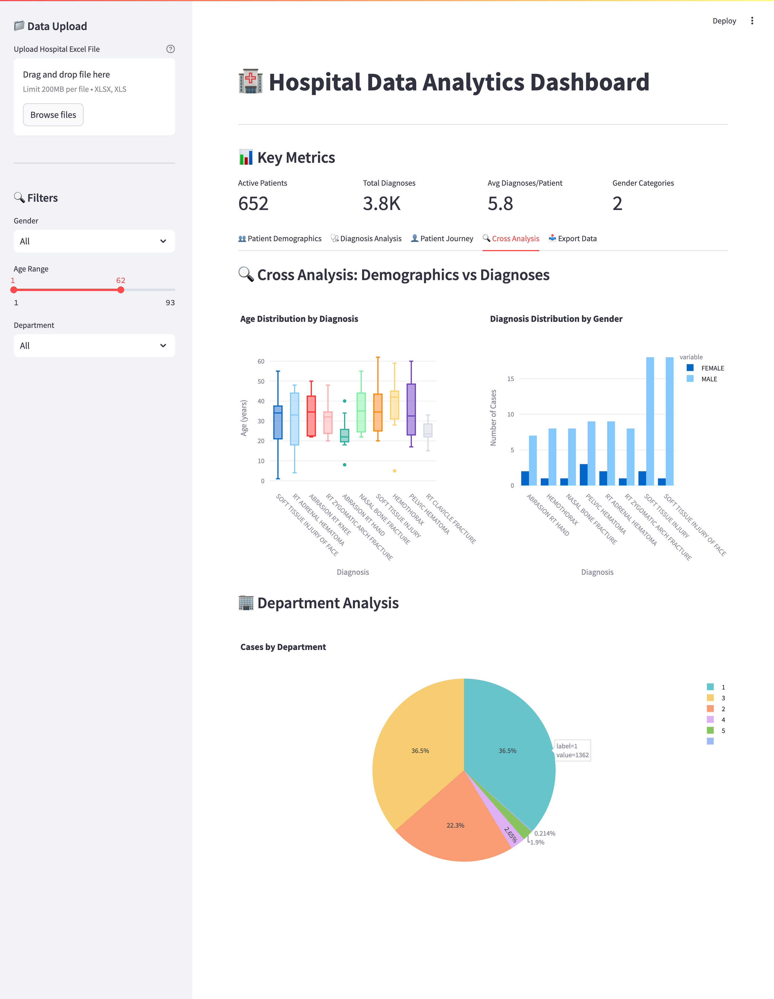
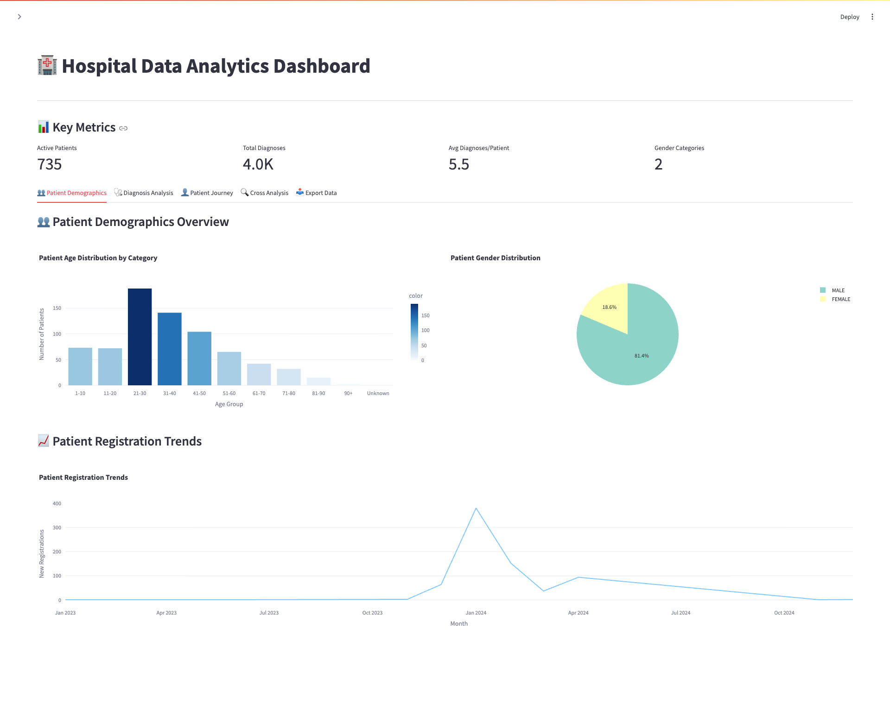
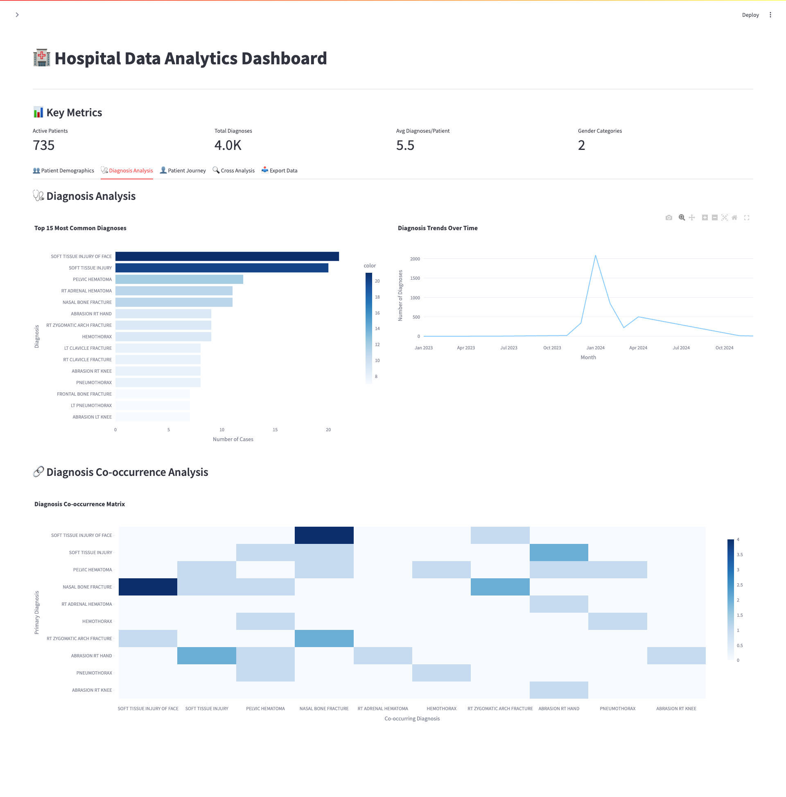
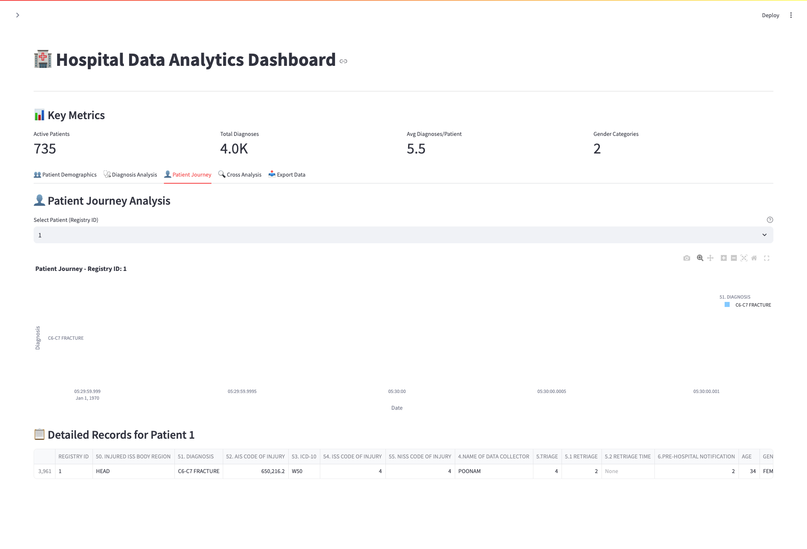
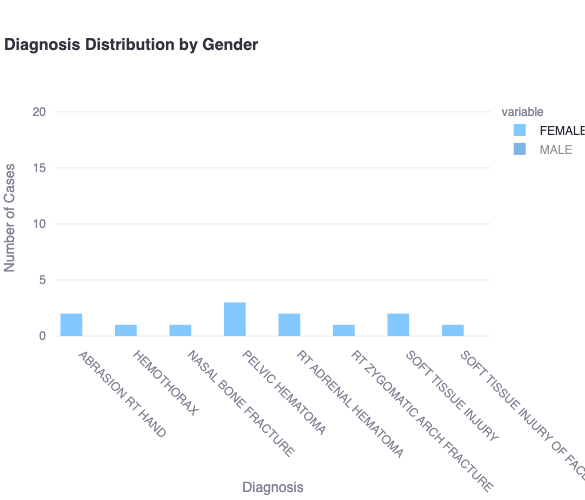
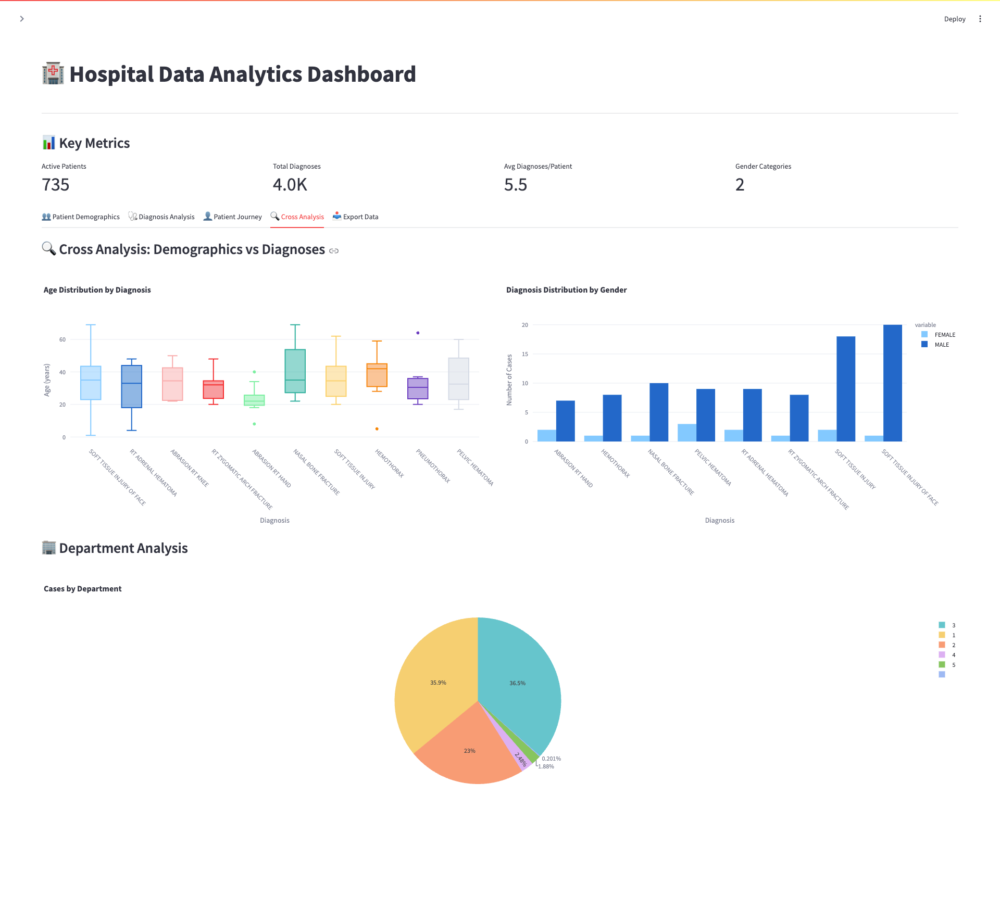

# 🏥 Hospital Data Analytics Dashboard

A comprehensive **Streamlit-based** interactive web application for analyzing hospital patient and diagnosis data. This dashboard transforms complex healthcare data into intuitive visualizations and actionable insights for healthcare administrators, analysts, and decision-makers.

[](https://python.org)
[](https://streamlit.io)
[](https://plotly.com)
[](LICENSE)

---

## 🌟 Key Features

### 📊 **Interactive Data Analytics**
- **Real-time Excel Processing**: Automatically detects and processes patient and diagnosis data sheets
- **Smart Data Validation**: Comprehensive data cleaning, validation, and integrity checks
- **Dynamic Filtering**: Filter by date ranges, demographics, departments, and categories
- **Cross-Analysis**: Explore relationships between patient demographics and diagnoses

### 🎯 **Comprehensive Visualizations**
- **Patient Demographics**: Age distribution, gender breakdowns, and registration trends
- **Diagnosis Analytics**: Top diagnoses, temporal trends, and co-occurrence patterns
- **Patient Journey**: Individual patient timeline and diagnosis history
- **Department Analysis**: Resource utilization and departmental performance
- **Interactive Charts**: Powered by Plotly for professional, interactive visualizations

### 🔧 **User-Friendly Interface**
- **Intuitive Design**: Clean, medical-professional interface with expandable sidebar controls
- **One-Click Upload**: Drag-and-drop Excel file processing
- **Export Capabilities**: Download processed data and generate summary reports
- **Responsive Layout**: Optimized for various screen sizes and devices

---

## 🏗️ Architecture & Design

### **Modular Structure**
```
├── app.py                 # Main Streamlit application and UI orchestration
├── data_processor.py      # Excel processing, validation, and data cleaning
├── visualizations.py      # Chart generation and visualization management
├── utils.py              # Utility functions for validation and formatting
└── pyproject.toml        # Project dependencies and configuration
```

### **Core Components**

#### 🔄 **DataProcessor Class**
- **Purpose**: Handles Excel file ingestion, data validation, and preprocessing
- **Features**:
  - Automatic sheet detection for patient and diagnosis data
  - Intelligent column mapping and standardization
  - Data type conversion and missing value handling
  - Registry ID-based data merging with integrity validation

#### 📈 **VisualizationManager Class**
- **Purpose**: Creates interactive charts and manages all visualization components
- **Features**:
  - Age distribution histograms with categorization
  - Gender and department distribution pie charts
  - Temporal trend analysis and registration patterns
  - Diagnosis co-occurrence heatmaps
  - Patient journey timelines

#### 🛠️ **Utility Functions**
- **Purpose**: Common functions for data validation, formatting, and export
- **Features**:
  - Data quality validation with error reporting
  - Text cleaning and standardization
  - Date detection and processing
  - Summary statistics generation

---

## 🚀 Quick Start

### **Prerequisites**
- Python 3.11 or higher
- Required packages (see `pyproject.toml`)

### **Installation**
```bash
# Clone the repository
git clone <repository-url>
cd hospital-dashboard

# Install dependencies
pip install -r requirements.txt

# Run the application
streamlit run app.py
```

### **Usage**
1. **Upload Data**: Use the sidebar to upload your Excel file containing patient and diagnosis data
2. **Automatic Processing**: The system detects sheets and validates data automatically
3. **Explore Insights**: Navigate through tabs to explore different analytics views
4. **Apply Filters**: Use sidebar controls to filter data by demographics, dates, and departments
5. **Export Results**: Download processed data and generate summary reports

---

## 📋 Data Requirements

### **Excel File Structure**
Your Excel file should contain **two sheets**:

#### **Patient Details Sheet**
- **Required Column**: `REGISTRY ID` (patient identifier)
- **Optional Columns**: `AGE`, `GENDER`, `ADMISSION_DATE`, `DISCHARGE_DATE`, etc.

#### **Diagnosis Details Sheet**
- **Required Column**: `REGISTRY ID` (links to patient data)
- **Optional Columns**: `DIAGNOSIS`, `DIAGNOSIS_DATE`, `DEPARTMENT`, etc.

### **Supported Data Formats**
- **File Types**: `.xlsx`, `.xls`
- **Sheet Names**: Automatically detected using keywords like "patient", "diagnosis", "details"
- **Data Types**: Numeric, text, date/time fields with automatic type inference
- **Missing Values**: Handled gracefully with appropriate warnings

---

## 📊 Dashboard Sections

### 1. **👥 Patient Demographics**
<details>
<summary>View Demographics Features</summary>

- **Age Distribution**: Categorized histogram showing patient age groups
- **Gender Breakdown**: Pie chart with gender distribution
- **Registration Trends**: Time-series analysis of patient registrations
- **Key Metrics**: Total patients, age statistics, gender diversity

</details>

### 2. **🩺 Diagnosis Analysis**
<details>
<summary>View Diagnosis Features</summary>

- **Top Diagnoses**: Horizontal bar chart of most common conditions
- **Temporal Trends**: Diagnosis frequency over time
- **Co-occurrence Matrix**: Heatmap showing diagnosis relationships
- **Department Analysis**: Cases by medical department

</details>

### 3. **👤 Patient Journey**
<details>
<summary>View Journey Features</summary>

- **Individual Timelines**: Patient-specific diagnosis history
- **Detailed Records**: Comprehensive patient data tables
- **Interactive Selection**: Dropdown to choose specific patients
- **Treatment Patterns**: Visualization of care progression

</details>

### 4. **🔍 Cross Analysis**
<details>
<summary>View Cross-Analysis Features</summary>

- **Age vs Diagnosis**: Box plots showing age distribution by condition
- **Gender vs Diagnosis**: Grouped bar charts for gender-specific patterns
- **Department Performance**: Resource utilization and patient distribution
- **Statistical Correlations**: Data-driven insights and relationships

</details>

### 5. **📥 Export & Reporting**
<details>
<summary>View Export Features</summary>

- **CSV Downloads**: Export patient, diagnosis, and merged datasets
- **Summary Reports**: Automated text-based analytics summaries
- **Timestamp Tracking**: Versioned exports with generation timestamps
- **Custom Filtering**: Export filtered data based on current dashboard filters

</details>

---

## 🎨 Screenshots & Visualizations

> **Note**: Add your dashboard screenshots here to showcase the interface and visualizations

### **Main Dashboard Interface**

*Overview of the main dashboard with key metrics and navigation tabs*

### **Patient Demographics**

*Age distribution and gender breakdown visualizations*

### **Diagnosis Analysis**

*Top diagnoses and temporal trend analysis*

### **Patient Journey**

*Individual patient timeline and detailed records view*

### **Interactive Filtering**

*Sidebar controls for dynamic data filtering*

### **Export Interface**

*Data export options and summary report generation*

---

## 🔧 Technical Specifications

### **Technology Stack**
- **Frontend**: Streamlit (1.47.0+) - Interactive web application framework
- **Data Processing**: Pandas (2.3.1+) - Data manipulation and analysis
- **Visualization**: Plotly (6.2.0+) - Interactive, professional-quality charts
- **Data Handling**: NumPy (2.3.1+) - Numerical computing support
- **File Processing**: OpenPyXL (3.1.5+) - Excel file reading and writing

### **Design Decisions**

#### **Framework Selection**
- **Streamlit**: Chosen for rapid prototyping and ease of deployment in healthcare environments
- **Plotly**: Selected over Matplotlib for interactive capabilities and professional medical visualization standards
- **Pandas**: Industry standard for healthcare data manipulation and analysis

#### **Architecture Patterns**
- **Separation of Concerns**: Distinct classes for data processing, visualization, and utilities
- **Session State Management**: Persistent data storage across user interactions
- **Modular Design**: Easy to extend with new chart types and maintain existing functionality

#### **Data Flow**
```
Excel Upload → Sheet Detection → Data Validation → Cleaning & Merging → Interactive Visualization → Export
```

---

## 🚀 Deployment Options

### **Local Development**
- **Environment**: Streamlit's built-in development server
- **State Management**: Session-based for single-user scenarios
- **File Handling**: Memory-based storage for moderate-sized datasets

### **Production Deployment**
- **Platforms**: Streamlit Cloud, Heroku, AWS, Docker containers
- **Scalability**: Designed for healthcare teams and department-level usage
- **Security**: File upload validation and data sanitization

### **Enterprise Considerations**
For multi-user production environments, consider adding:
- Database integration for persistent data storage
- User authentication and role-based access control
- File storage optimization for large datasets
- Audit logging for compliance requirements

---

## 🤝 Contributing

We welcome contributions to improve the Hospital Data Analytics Dashboard! Here's how you can help:

### **Development Setup**
```bash
# Fork and clone the repository
git clone <your-fork-url>
cd hospital-dashboard

# Create a virtual environment
python -m venv venv
source venv/bin/activate  # Linux/Mac
# or
venv\Scripts\activate     # Windows

# Install dependencies
pip install -e .
```

### **Contribution Guidelines**
1. **Fork** the repository and create a feature branch
2. **Write tests** for new functionality
3. **Follow** existing code style and documentation patterns
4. **Submit** a pull request with detailed description
5. **Ensure** all existing tests pass

### **Areas for Contribution**
- Additional visualization types (e.g., survival analysis, treatment outcomes)
- Enhanced export formats (PDF reports, PowerBI integration)
- Advanced filtering and search capabilities
- Performance optimizations for large datasets
- Mobile responsiveness improvements

---

## 📜 License

This project is licensed under the MIT License - see the [LICENSE](LICENSE) file for details.

---

## 📞 Support & Contact

- **Issues**: Report bugs and request features via [GitHub Issues](issues-url)
- **Documentation**: Additional documentation available in the `/docs` folder
- **Community**: Join our discussions in [GitHub Discussions](discussions-url)

---

## 🙏 Acknowledgments

- **Streamlit Team**: For creating an excellent framework for data applications
- **Plotly**: For providing professional-quality interactive visualizations
- **Healthcare Community**: For feedback and real-world testing scenarios
- **Open Source Contributors**: All contributors who help improve this project

---

**Made with ❤️ for the Healthcare Community**

*Transforming complex hospital data into actionable insights through intuitive, interactive dashboards.*
---
